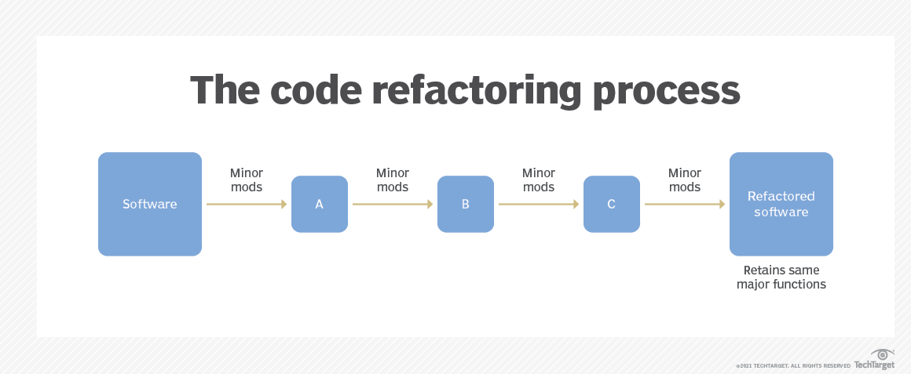

# On this session, i'm learn about Refactoring Code

## What is Refactoring?
> Refactoring is the process of restructuring code, while not changing its original functionality. 
## What is the purpose of refactoring?
> Refactoring improves code by making it:
 
    1. More efficient by addressing dependencies and complexities.
 
    2. More maintainable or reusable by increasing efficiency and 
       readability.
 
    3. Cleaner so it is easier to read and understand.
 
    4. Easier for software developers to find and fix bugs or 
    vulnerabilities in the code.
    
 
## When should code be refactored?
> For me, refactoring the code when we have finished the 'product' that we made, because it aims to familiarize and make it easier for us later when accessing our code.