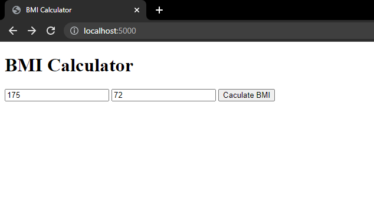
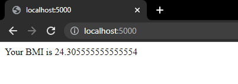

# On this session, im start learn about Backend Web Developmet using Javascript

 I created a web server using express JS and made a simple BMI calculator website using body-parser.

Preview :
> 
>
> 