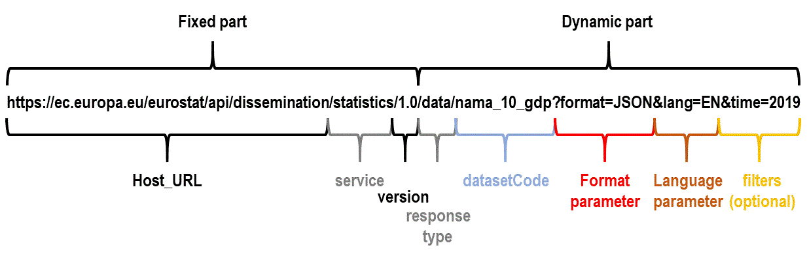

# On this session, im start learn about API

## What is API?
> API (APlication Programming Interfaces)  are mechanisms that enable two software components to communicate with each other using a set of definitions and protocols

## What is Resful API?
> RESTful API is a designation for web services that implement the REST architecture.

## What is Endpoint, Path, Parameters and Authentication on API?
> ### Endpoint
> >Endpoint is the end point (URL) in the API that is used by the client (client) to access the resources or services provided by the API. 
>>
> >Endpoints serve as entry points or gateways for communicating with the API. Example endpoints: https://api.example.com/users or https://api.example.com/products.
> ### Path
> >Path is the part of the URL that follows the domain in the endpoint. Paths are used to identify specific resources or services within the API
>>
> >Example paths: /users or /products. This path is usually defined by the API provider according to their API design.
> ### Parameters
> >Parameters are additional information that can be sent with an API request to set or modify API behavior.
>>
> >Parameters are usually located in a URL or in the body of the API request, and are used to pass data such as filters, sorting, paging, or other data required by the API. Example parameters: https://api.example.com/users?name=john&age=25.
> ### Authentication
> >Authentication is the process of verifying the identity of a user or application accessing the API.
>>
> >Authentication is used to maintain API security and ensure only authorized users can access resources or services in the API. There are various authentication methods that can be used in the API, such as token-based authentication, OAuth, API key, or Basic Authentication.
## Structure of API
> 

## HTTPS Methods
> - GET     = for getting data
> - POST    = for sendding data
> - PUT     = for update data
> - DELETE  = for delete data

## HTTPS Response Code
> - 200 (ok)  :
> > The client request was successfully executed by the server.
> - 201 (created) :
> >The server succeeded in creating/adding the resource requested by the client.
> - 400 (Bad Request)
> > The client request failed to execute because the input validation process from the client failed.
> - 401 (Unauthorized) :
> > The client request failed to execute. Usually this is caused because the user has not done the authentication process.
> - 403 (Forbidden) :
> > The client request failed to execute because it does not have access rights to the requested resource.
> - 404 (Not Found)
> > The client request failed to execute because the requested resource was not found.
> - 500 (Internal Server Error) :
> > The client request failed to execute because the server experienced an error (raising an exception).