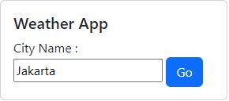
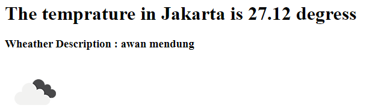

# On this session, im start make "Wheater App Project", using API

<p align="center">

</p>
<p align="center">

</p>

## Technology used 
- Open Wheater API
- Express JS
- Body-Parser

## How to use this program
- Add your API-KEY
```
//server.js/line 16
const apiKey = 'Your-API-Key';
```
- Add your Languague
```
//server.js/line 18
const language = 'Your-Language'
```

## How to start
- node server.js