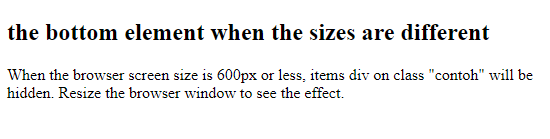

# On this session, i'm learn how to create responsive website using media query

## Media query is a CSS technique introduced in CSS3.

It uses the @media rule to include a block of CSS properties only if a certain condition is true.

## on this case 
If the browser window is 600px or smaller, tthen the items from the div with class "contoh" will be hidden

### Preview 
on desktop size :
 

on mobile phone size :
 

### For detail documentation juts read on mozila org or m3school website....
