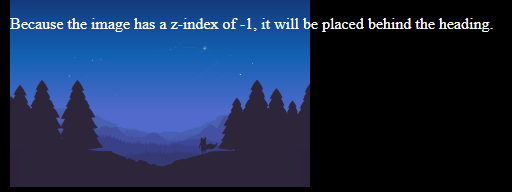
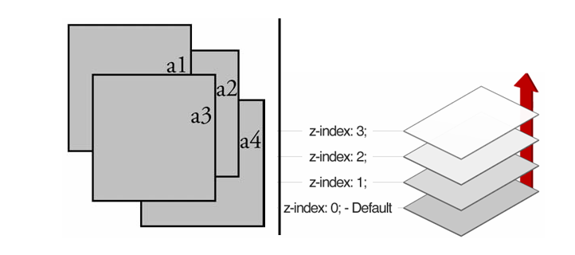

# On this session, i'm learn CSS Z-index

## CSS Z-index

The z-index property specifies the stack order of an element.

An element with greater stack order is always in front of an element with a lower stack order.

<strong>

    Note: z-index only works on positioned elements (position: absolute, position: relative, position: fixed, or position: sticky) and flex items (elements that are direct children of display:flex elements).

    Note: If two positioned elements overlap without a z-index specified, the element positioned last in the HTML code will be shown on top.
 
 </strong>

## Preview 
 

Ilustration of Z-index :
 
 

### For detail documentation juts read on mozila org or m3school website....