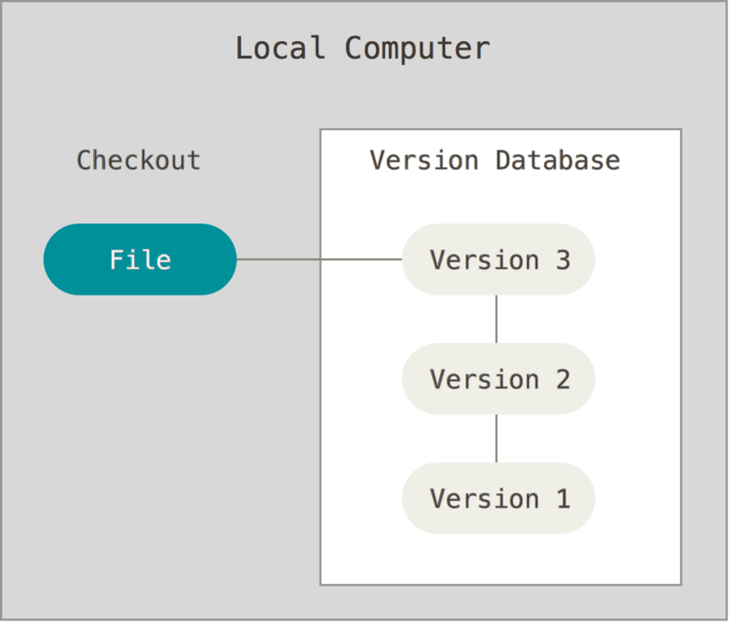

# On this session, im learn about Version Control, Git and Github

## What is Version Control System?
> Version control system (vcs) is a system that records changes over time to files, or folders so that we can review specific versions later
 
<h3>Version Control Type</h3>
 <ul>
  <li> 
     <h4>Local version control systems</h4>
     
  </li>
  <li> 
     <h4>Centralized version control systems</h4>
     
  </li>
   <li> 
     <h4>Distributed version control systems</h4>
     
   </li>
  </ul>
> note: img form git-scm.com